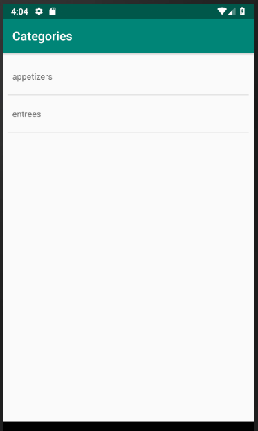
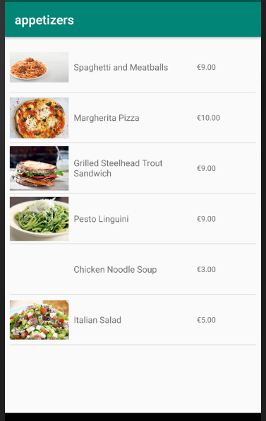
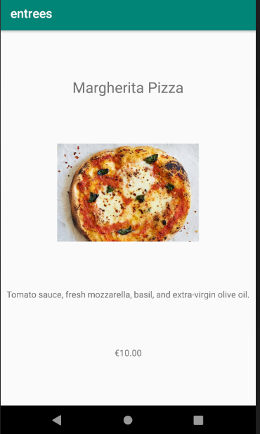
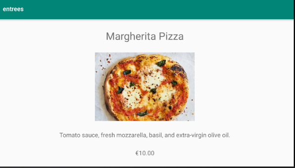

# NAS19-Restaurant

This app allows the user to browse through a restaurant's menu. This app uses an API to obtain information on different categories of menus, and details for the items on these menus. Furthermore it uses Picasso to obtain and render images stored on the web. This app works on different screen sizes and allows for landscape mode.

## The app in action

## Menu item detail screen

